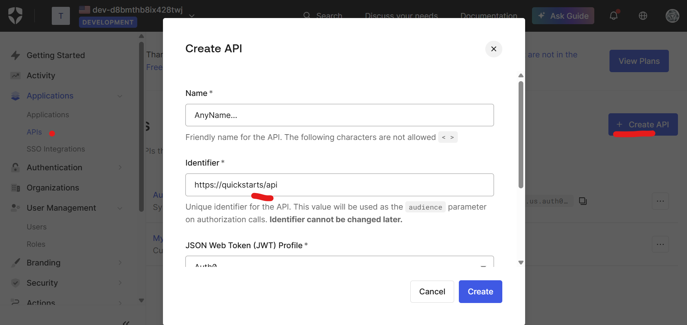
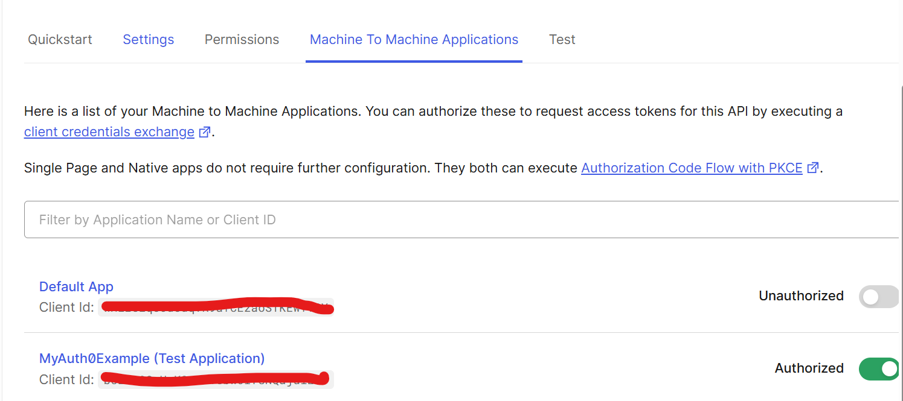
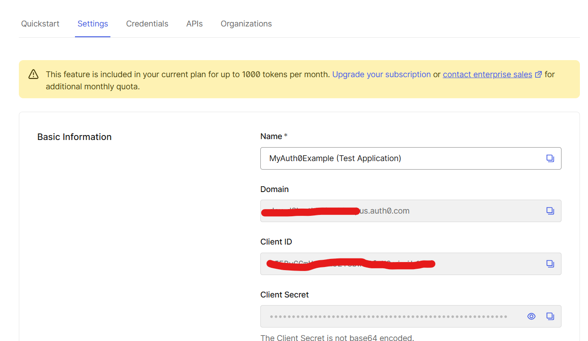
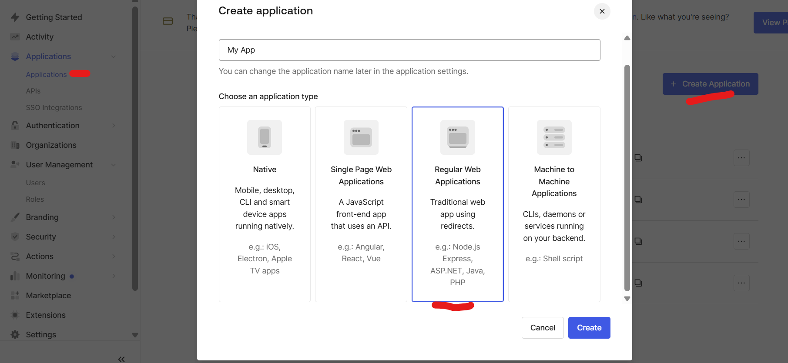
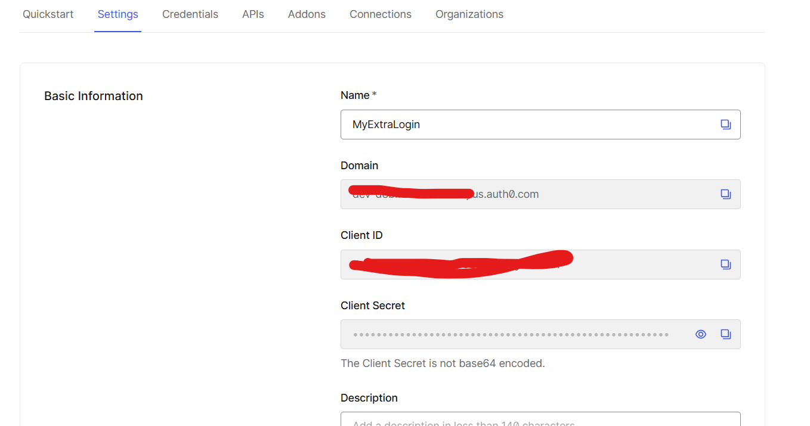
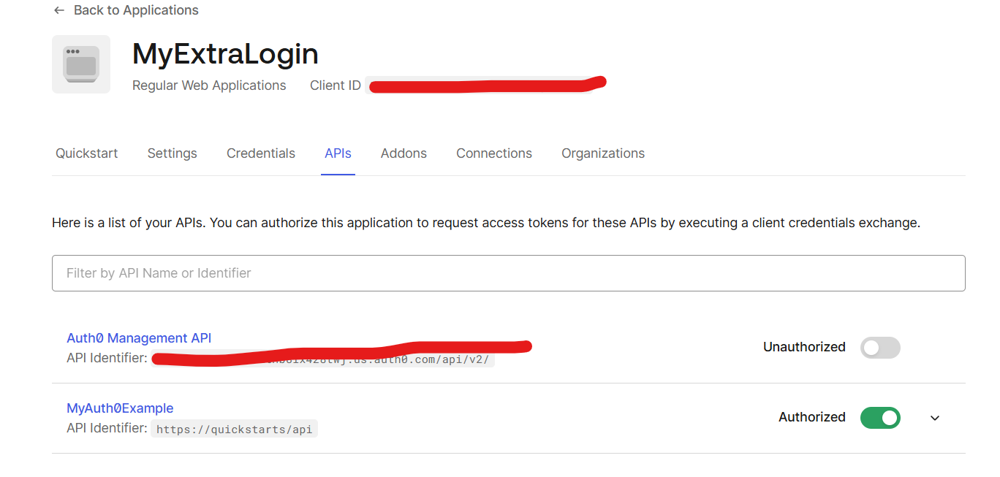
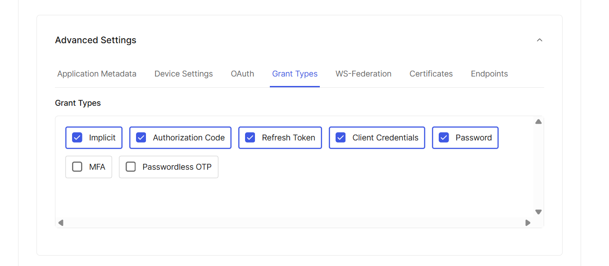
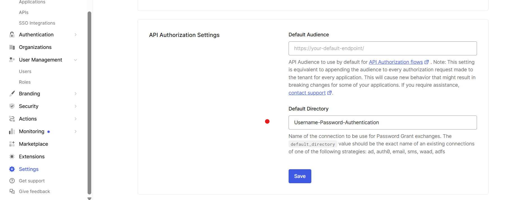
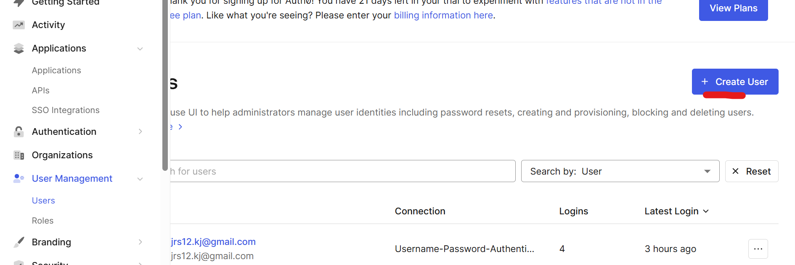

# Simple Auth0 Implementation


## Structure

### api
Based on Django-like basic structure
api/  \
├─ employees/ (django app) \
│  ├─ migrations/ (all database operations for this app)\
│  ├─ __init__.py\
│  ├─ admin.py (admin model declarations)\
│  ├─ apps.py (app django config)\
│  ├─ models.py (models declarations)\
│  ├─ serializers.py (drf serializers for the app)\
│  ├─ test.py\
│  ├─ urls.py (app urls)\
│  ├─ views.py \
├─ templates/ (django templates)\
├─ DjangoAuth0/\
│  ├─ __init__.py\
│  ├─ asgi.py\
│  ├─ settings.py  (django main config)\
│  ├─ ├─  __init__.py\ (start point of config) \
│  ├─ ├─ Components\
│  ├─ ├─ ├─ auth0.py (auth0 configs)\
│  ├─ ├─ ├─ auth0.py (drf configs)\
│  ├─ ├─ ├─ common.py (utilities for configs)\
│  ├─ urls.py   (root of urls)\
│  ├─ wsgi.py\
├─ .env\
├─ __init__.py\
├─ Dockerfile\
├─ Docker-compose\
├─ manage.py\
├─ requirements.txt\


## Prerequisites
To setup your local environment, you need install Docker Engine and docker-compose. You can follow the instructions [here](#How-to-install-Docker) to install.

### How to install Docker

Docker Engine is available on a variety of [MacOS](https://docs.docker.com/docker-for-mac/install/)

### How to install docker-compose

Docker compose is available on [MacOs](https://docs.docker.com/compose/install/)


### Running services

If you have already set up your local environment and have a **.env** file with the development variables set, this command builds the image  services:

```shell
$ docker-compose up -d
```
  - [http://127.0.0.1:8000](http://127.0.0.1:5000) is the Django app


## How to rebuild the docker image

In case you want the changes you have been testing to remain permanently in a new docker image you can rebuild the image, run this command:

```shell
$ docker-compose build
$ docker-compose up -d
```

After the build, you can remove the previous image with:

```shell
$ docker image prune -f
```

## Container shell access 

The docker exec command allows you to run commands inside a Docker container. The following command line will give you a bash shell inside your containers: `docker exec -it <container_name> <command>`


## Services

### Get a  user token

```http
POST /auth0/public/get_user_token
{
	"username":"example@mail.com",
	"password:"abcPASS123!"
}
```
Note: The user must already exist on auth0

### Get machine to machine token
```http
GET /auth0/public/get_token
```

### Protected Endpoint
```http
POST http://localhost:8000/auth0/private/
Content-Type: application/json
Authorization: Bearer 

{
  "text": "hola mundo"
}

```

### Agregated Endpoint
```http
GET http://localhost:8000/auth0/public/

Response
{
    "count": 1
}
```


## Auth0Config
In order to run this project you need to create a auth0 Account
- https://auth0.com/

## Create an API

The identifier provided here will be your AUTH0_API_ID env

By default a machine to machine app will be created, open it 



Note  
The domain will be the **AUTH0_DOMAIN** env  
Client id the **AUTH0_MTM_CLIENT_ID** \
client secret the **AUTH0_MTM_CLIENT_SECRET**   

Also in  order to use Users you must create and web app


This values will be the next envs  
client id -> AUTH0_APP_CLIENT_ID  
client secret -> AUTH0_APP_CLIENT_SECRET


This app must have permission to use the api


And enable the password grant type



## Enable default
In order to be able to login at the provided enpoint you neet to set default directory



### Create User
At Auth0Panel
